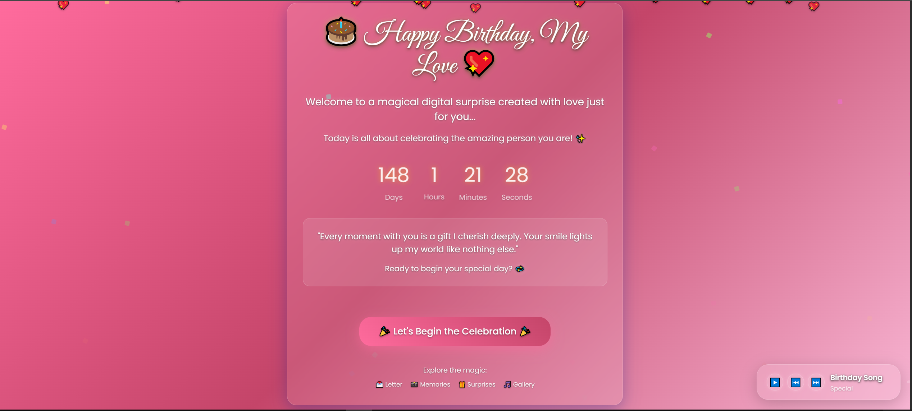
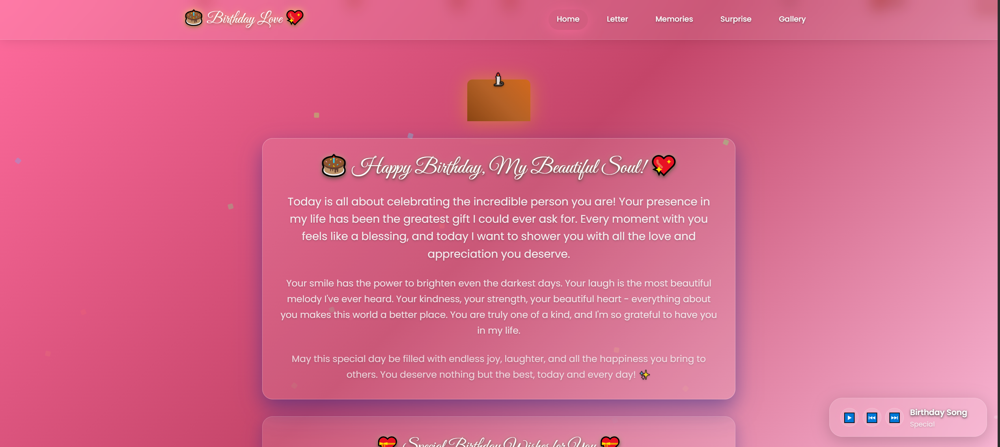
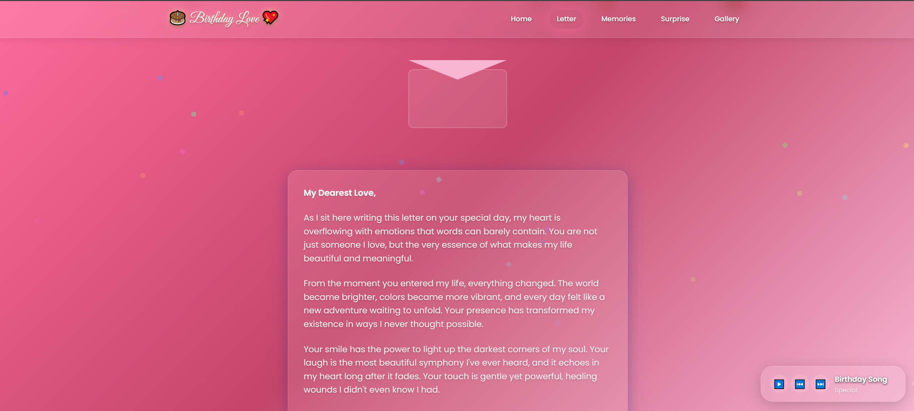
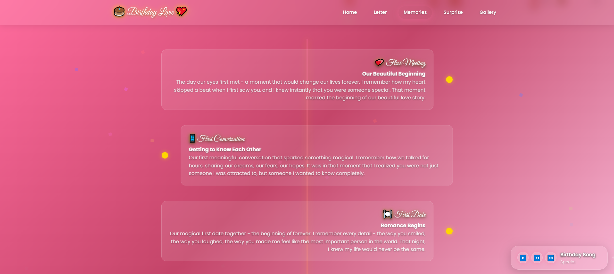
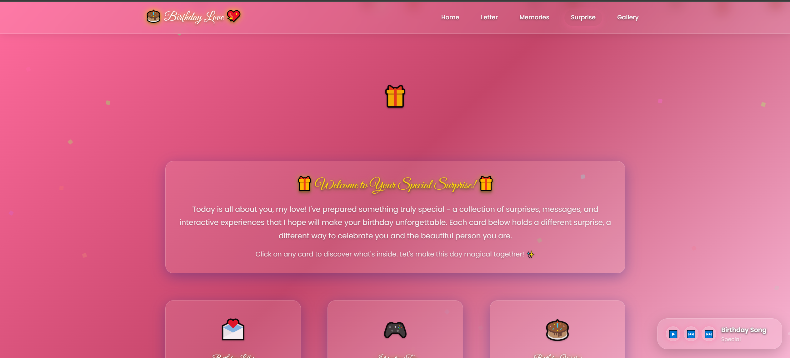
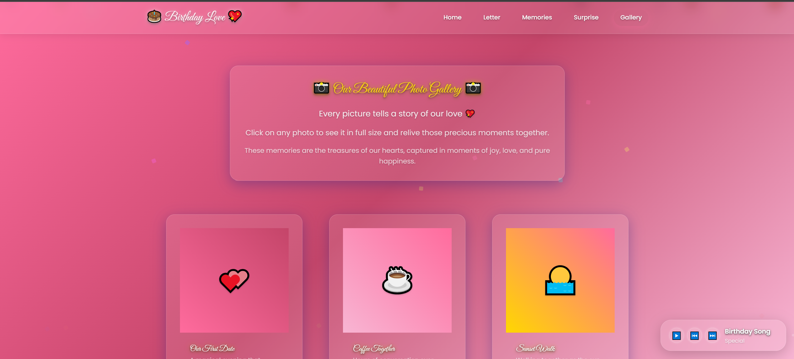
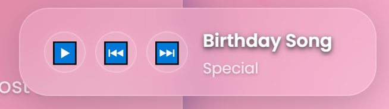
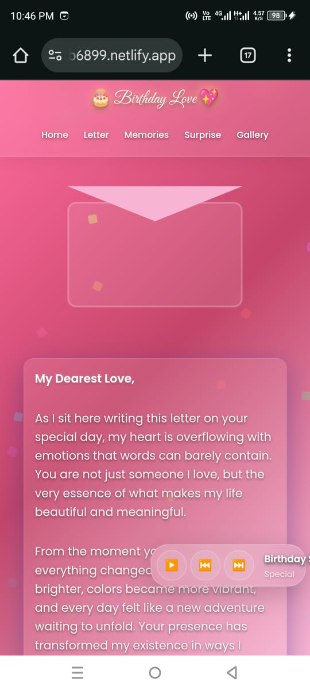

# 🎂 Birthday Website - A Digital Love Letter 💖

A beautiful, interactive birthday website created with love and care. This project features smooth animations, romantic design, and a complete digital birthday experience.

## ✨ Features

- **🎨 Beautiful Design**: Gradient backgrounds with glass-morphism effects
- **🎵 Music Player**: Interactive music controls with smooth animations
- **📸 Photo Gallery**: Organized photo and video sections
- **💌 Love Letters**: Personalized birthday messages
- **📅 Timeline**: Interactive memories timeline
- **🎁 Surprises**: Special birthday surprises and animations
- **📱 Responsive**: Works perfectly on all devices
- **⚡ Smooth Animations**: CSS animations and transitions
- **🎯 Interactive Elements**: Hover effects and smooth scrolling

## 🚀 Quick Start

1. **Clone the repository**:
   ```bash
   git clone https://github.com/yourusername/birthday-website.git
   cd birthday-website
   ```

2. **Open in browser**:
   - Simply open `index.html` in your web browser
   - Or use a local server:
     ```bash
     python -m http.server 8000
     ```
   - Then visit `http://localhost:8000`

## 📁 Project Structure

```
birthday-website/
├── index.html          # Welcome page
├── home.html           # Main content page
├── letter.html         # Love letters
├── memories.html       # Timeline of memories
├── surprise.html       # Birthday surprises
├── gallery.html        # Photo gallery
├── assets/
│   ├── css/
│   │   └── style.css   # Main stylesheet
│   └── js/
│       └── main.js     # JavaScript functionality
├── COLOR_SCHEME.md     # Color scheme documentation
└── README.md          # This file
```

## 📸 Screenshots

### 🎂 Welcome Page

*The beautiful welcome page with animated hearts and birthday countdown*

### 🏠 Home Page

*Main content page with navigation cards and birthday messages*

### 💌 Love Letters

*Personalized birthday letters with romantic design*

### 📅 Memories Timeline

*Interactive timeline showing special moments and memories*

### 🎁 Birthday Surprises

*Special birthday surprises and interactive elements*

### 📸 Photo Gallery

*Beautiful photo and video gallery with smooth transitions*

### 🎵 Music Player

*Fixed position music player with controls and volume slider*

### 📱 Mobile Responsive

*Perfectly optimized for mobile devices*

## 🎨 Design Features

- **Color Scheme**: Romantic pink and gold gradients
- **Typography**: Beautiful fonts with smooth text shadows
- **Animations**: CSS keyframes for smooth transitions
- **Glass Effects**: Backdrop blur and transparency
- **Responsive Design**: Mobile-first approach

## 🛠️ Technologies Used

- **HTML5**: Semantic markup
- **CSS3**: Modern styling with variables and animations
- **JavaScript**: Interactive functionality
- **Git**: Version control

## 💝 Customization

The website is fully customizable:

- **Colors**: Edit CSS variables in `assets/css/style.css`
- **Content**: Modify text in HTML files
- **Images**: Replace placeholder content with real photos
- **Music**: Add your own music files

## 🌟 Special Features

- **Loading Screen**: Animated heart loading
- **Floating Hearts**: Dynamic background animation
- **Confetti**: Birthday celebration effects
- **Music Player**: Fixed position with controls
- **Smooth Scrolling**: Enhanced user experience
- **Scroll to Top**: Convenient navigation

## 📱 Mobile Optimized

- Responsive design for all screen sizes
- Touch-friendly interactions
- Optimized animations for mobile devices
- Proper viewport settings

## 🎯 Browser Support

- Chrome (recommended)
- Firefox
- Safari
- Edge

## 📄 License

This project is created with love and is free to use and modify.

## 💌 Made with Love

This birthday website was created as a special digital gift, combining modern web technologies with heartfelt design to create a memorable birthday experience.

---

**Happy Birthday! 🎉💖** 